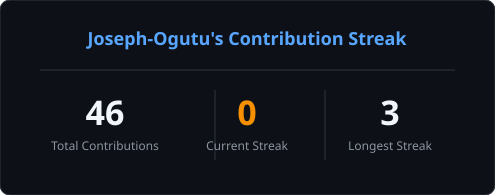
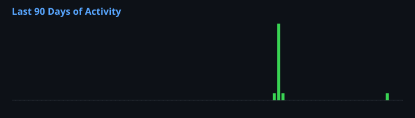

<h1 align="center">I Build Cool Stuff!</h1>
<h3 align="center">Machine Learning Software Engineer</h3>

Building AI-powered software, intelligent automation, enterprise platforms, and scalable cloud applications.

---

## About Me
I am a Machine Learning Software Engineer focused on building production-ready software powered by Artificial Intelligence.
My work spans AI systems, enterprise software, cloud infrastructure, backend engineering, and modern web applications.
I enjoy solving real-world business problems using clean architecture, scalable systems, and automation.

---

## Technology Stack

---

## Featured Projects
| Project | Description |
|---------|-------------|
| STRATNOVO  | AI, Software Engineering and Digital Transformation Agency |
| RUMIA Platform | Property and Hostel Management Platform |
| KEWASNET AI Assistant | Enterprise AI Assistant powered by MCP |
| Learning Management System | AI-powered LMS built using Django and Next.js |
| FlyingDecksman | Music Streaming Platform with Integrated Payments |

---

## Connect With Me

---

## GitHub Statistics

---

## Contribution Streak

---

## GitHub Trophies

---

## Contribution Graph

---

## Current Focus
- Artificial Intelligence
- Machine Learning
- AI Agents
- MCP
- Backend Engineering
- Enterprise Software
- Cloud Infrastructure
- Distributed Systems
- Secure APIs
- System Architecture

---

## Certifications
- Machine Learning Engineer
- Artificial Intelligence
- AWS Cloud Computing
- API Security
- Threat Modeling for AI/ML Systems
- Digital Transformation

---

## Philosophy
> The world is not interested in what you know.
> But the world is more interested in.
> What you can do with what you know.

---

### Thank you for visiting my profile.

